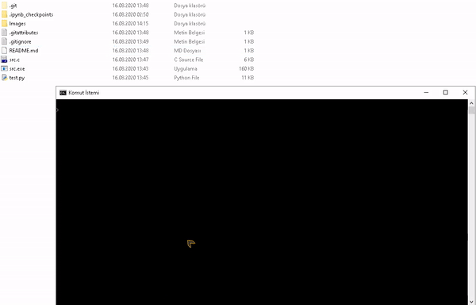
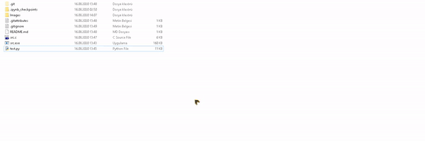

# SpyderToJupyterConverter
 C program to convert Spyder Python Script/Notebook to Jupyter Notebook in milliseconds.

---
## Run

User can give Spyder Script as an argument to main function or as an input to running program.

### Path as an argument:

### Path as an program input:

